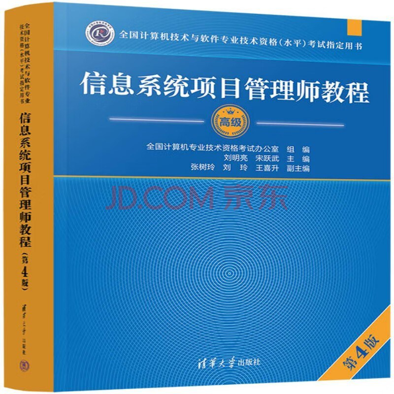

- 
- 第一章 信息化发展
	- 1.1 [[信息]]与信息化
	- 1.2 现代化基础设施
	- 1.3 现代化创新发展
	- 1.4 数字中国
	- 1.5 数字化转型与元宇宙
- 第二章 信息级数发展
- 第三章 信息系统治理
- 第四章 信息系统管理
- 第五章 信息系统工程
	- 5.1 [[软件工程]]
		- 5.1.1 [[架构设计]]
		- 5.1.2 需求分析
		- 5.1.3 软件设计
		- 5.1.4 软件实现
		- 5.1.5 部署交付
		- 5.1.6 过程管理
	- 5.2 数据工程
		- 5.2.1 数据建模
		- 5.2.2 数据标准化
		- 5.2.3 数据运维
		- 5.2.4 数据库安全
		- 5.2.5 数据库安全
	- 5.3 系统集成
		- 5.3.1 集成基础
		- 5.3.2 网络集成
		- 5.3.3 数据集成
		- 5.3.4 软件集成
		- 5.3.5 应用集成
	- 5.4 安全工程
		- 5.4.1 工程概述
		- 5.4.2 安全系统
		- 5.4.3 工程体系架构
	- 5.5 本章练习
- 第六章 项目管理概论
	- 6.1 PMBOK的发展
	- 6.2 项目基本要素
		- 6.2.1 项目基础
			- 1.独特的产品、服务或成果
		- 6.2.2 项目管理的重要性
	- 6.3 项目经理的角色
	- 6.4 价值驱动的项目管理知识体系
	- 6.4 本章练习
- 第七章 项目==立项==管理
- 第八章 项目==整合==管理
- 第九章 项目==范围==管理
- 第十章 项目==进度==管理
- 第十一章 项目==成本==管理
- 第十二章 项目==质量==管理
- 第十三章 项目==资源==管理
- 第十四章 项目==沟通==管理
- 第十五章 项目==风险==管理
- 第十六章项目==采购==管理
- 第十七章 项目==干系人==管理
- 第十八章 项目==绩效==管理
- 第十九章 配置与变更管理
- 第二十章 高级项目管理
- 第二十一章 项目管理科学基础
- 第二十二章 组织通用治理
- 第二十三章 组织通用管理
- 第二十四章 法律法规与标准规范