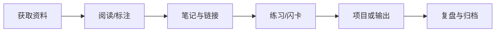

# 数字化学习工具

- 电子书籍与文献管理
- 在线学习平台
- 笔记、搜索和协作软件
- 间隔复习与闪卡工具
- 图表、模拟和开发环境

## 工具链设计

```mermaid
flowchart LR
    A[获取资料] --> B[阅读/标注]
    B --> C[笔记与链接]
    C --> D[练习/闪卡]
    D --> E[项目或输出]
    E --> F[复盘与归档]
```

选择工具时关注数据开放性、跨设备使用、离线能力、隐私、导出备份和长期维护成本。避免让同一条信息分散在多个工具里却没有明确的主存储位置。
