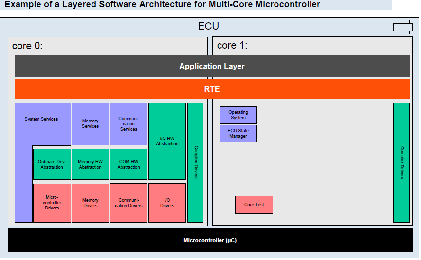
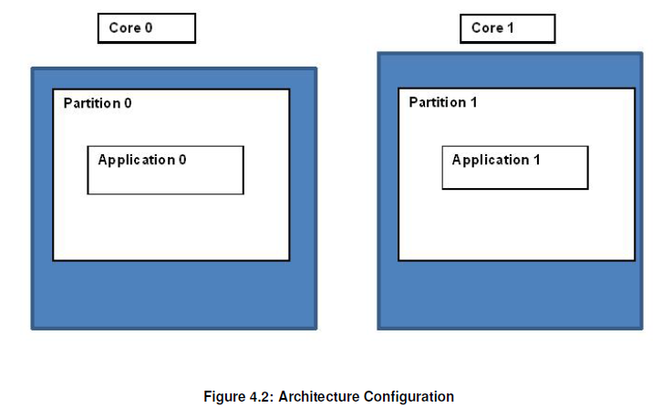

> ​​​​​Autosar Multicore Architecture Overview

​​​​​**Autosar Multicore Architecture Overview**

* Multicore Architecture for Autosar(4.0.3)  

*   Every runs a kind of Ecu Statemanagement .

*   Only Autosar Os and EcuM runs on all the cores and all  other BSW modules runs only on Master core.

*   Application can reside on slave cores also and these can interact with application on 
*   master core through ​Inter OS Application Communication (IOC).
*   Slave application can also perform inter ECU communication through Can/Flexray/Lin, but in this case communication of signals happen from slave to master or master to slave through IOC .  
    

> Physical core which is kind of replica of Master Core which have same or different strengths and functionalities.

> An AUTOSAR OS must be capable of supporting a collection of OS objects (tasks, interrupts, alarms, hooks etc.) that form a cohesive functional unit. All objects which
> 
> belong to the same OS-Application have access to each other. Access means to allow to use these objects within API services.

> Memory Partition means portioning the memory based on access rights. Example one Application cannot indulge in memory area prescribed for other application.
> 
> Partitions are also used for fault containment.

**Multicore Initialization and Startup procedure In Autosar Architecture​**  

Below diagram explains the generic startup sequence in Autosar multicore architecture before OS start running.  

Once the OS starts running on master and slave core , software execution  will follow the normal procedure  same as in a single core system

This is explained in the below diagram .

> > > >  
> > > > 
> > > >  

**Multicore Synchronization**

Below figure explains initialization sequnce of multicore system and there synchronization.  

**Inter Os Communication​**  

The IOC provides communication services between OSApplications and in particular over core boundaries in MultiCore systems.

All communication between OS application should be through protected mechanism i.e.IOC. 

This means all sender receiver communication and client server communication between two SWC belongs to different application 

should be through IOC. User need to configure all communication mechanism either sender receiver or Client server in usual way 

as he do for intra application this means user need not to take care of configuring IOC. RTE will take care of translating all those 

communication i.e. S/R or C/S which are between inter application through IOC.

Below is example of translation of sender receiver communication between two applications through IOC.

**Access COM from slave core in a multicore system**

In case of a multi core system, if a software component on the slave core wants to send data to a software component on another ECU,

 the RTE has to send data from the slave core through the IOC to the master core which in turn use the services of COM module in master Core .

The same approach is required for receive case where the master core is responsible for forwarding received COM data to slave core through IOC.

RTE is reponsible to use IOC if the communication is required between Cores.

> > > > > **​​​​​​****​****​****​****Slave Core Receive Data from COM Module** 

> > > > > > **​​​​​​​​​​​​Slave Core Send data to COM Module** 

**​​​​**  

**Multicore Shutdown**

Autosar R4.0 supports synchronized shutdown concept and does not support individual core shutdown. Synchronized shutdown is triggered through 

API function ShutdownAllCores(). The master ECU Manager module calls a single ShutdownAllCores rather than somehow calling ShutdownOs on 

the individual cores. The ShutdownAllCores stops the OS on all cores and stops all cores  as well. Since the master core could issue the

ShutdownAllCores before all slave cores are finished processing, the cores must be synchronized before entering SHUTDOWN. Master core will wait 

for all slavecore through WaitEvent call . Slave core will report event using SetEvent.

**There are some changes introduced in the later releases of AUTOSAR. Following section describe the multicore Architecture** 

**as per the latest** **release AUTSOAR 4.2 .**

The distribution of BSW modules onto different partitions was introduced in AUTOSAR 4.2. The BSW modules can be distributed over different partitions

and therefore over different cores . BswM have to be included into every partition . But other modules like OS and EcuM have to be included into one   

partition per core. As same as in ASR 4.0.3,  in ASR 4.2  also EcuM has to be distribuited in a way , that one instance exist in each core.

Initialization of Master Core and slave core remains same as described above for the ASR 4.0.3 architecture.BswM on each partition will be initialized 

by the curresponding EcuM on the core where the partition is located.