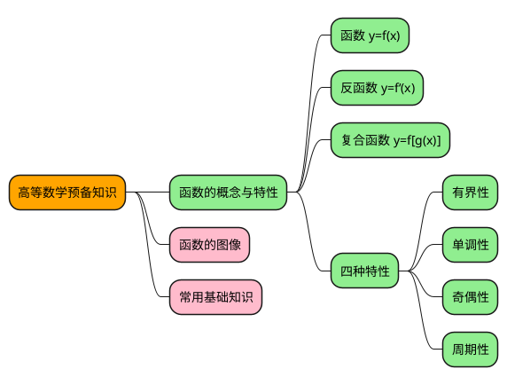

```plantuml
@startmindmap
+[#Orange] 高等数学预备知识
++[#lightgreen] 函数的概念与特性
+++[#lightgreen] 函数 y=f(x)
+++[#lightgreen] 反函数 y=f‘(x)
+++[#lightgreen] 复合函数 y=f[g(x)]
+++[#lightgreen] 四种特性
++++[#lightgreen] 有界性
++++[#lightgreen] 单调性
++++[#lightgreen] 奇偶性
++++[#lightgreen] 周期性
++[#FFBBCC] 函数的图像
++[#FFBBCC] 常用基础知识
@endmindmap

```