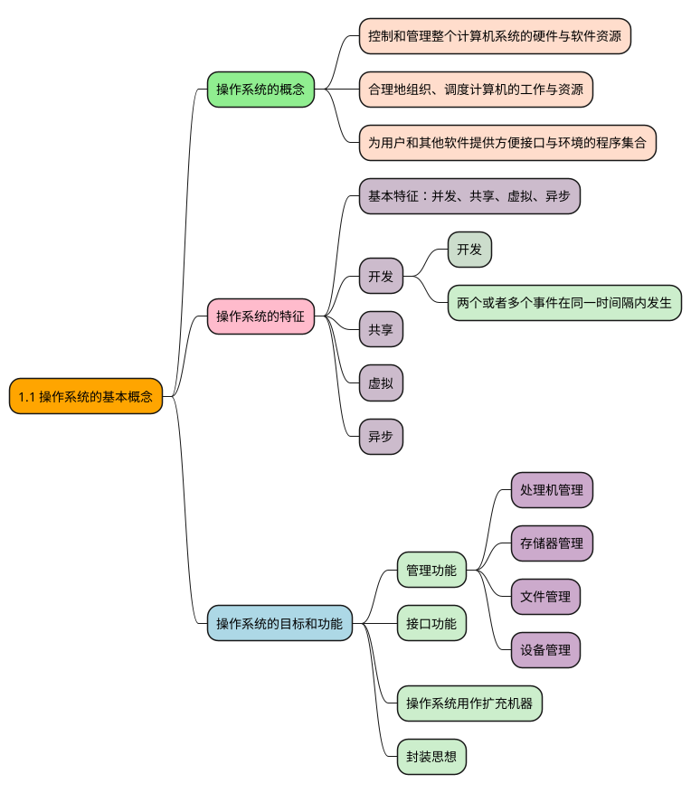

# 操作系统

# 第一章 计算机系统概述

```plantuml
@startmindmap
*[#Orange] 1.1 操作系统的基本概念
**[#lightgreen] 操作系统的概念
***[#FFDDCC] 控制和管理整个计算机系统的硬件与软件资源
***[#FFDDCC] 合理地组织、调度计算机的工作与资源
***[#FFDDCC] 为用户和其他软件提供方便接口与环境的程序集合
**[#FFBBCC] 操作系统的特征
***[#CCBBCC] 基本特征：并发、共享、虚拟、异步
***[#CCBBCC] 开发
****[#CCDDCC] 开发
****[#CCEECC] 两个或者多个事件在同一时间隔内发生
***[#CCBBCC] 共享
***[#CCBBCC] 虚拟
***[#CCBBCC] 异步
**[#lightblue] 操作系统的目标和功能
***[#CCEECC] 管理功能
****[#CCAACC] 处理机管理
****[#CCAACC] 存储器管理
****[#CCAACC] 文件管理
****[#CCAACC] 设备管理
***[#CCEECC] 接口功能
***[#CCEECC] 操作系统用作扩充机器
***[#CCEECC] 封装思想
@endmindmap


```